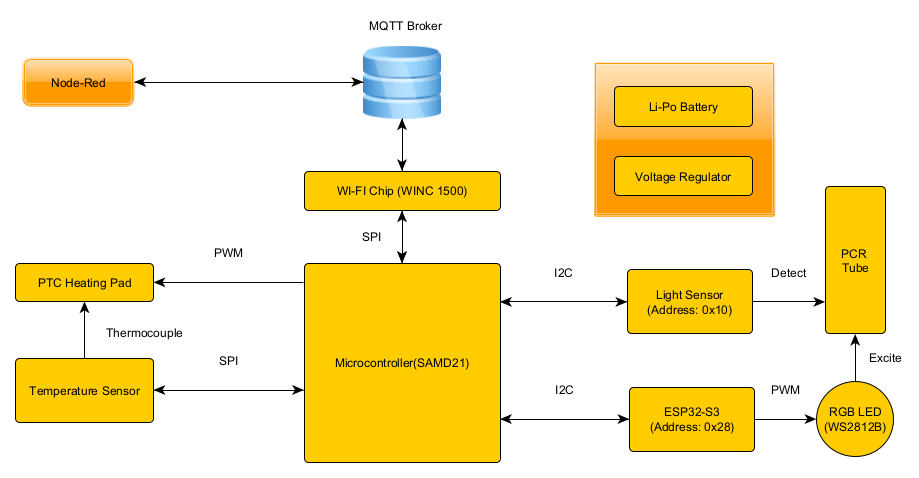
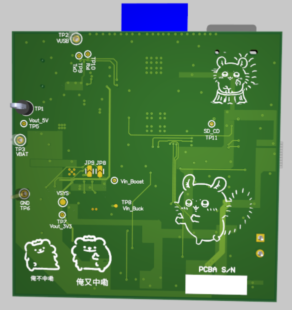
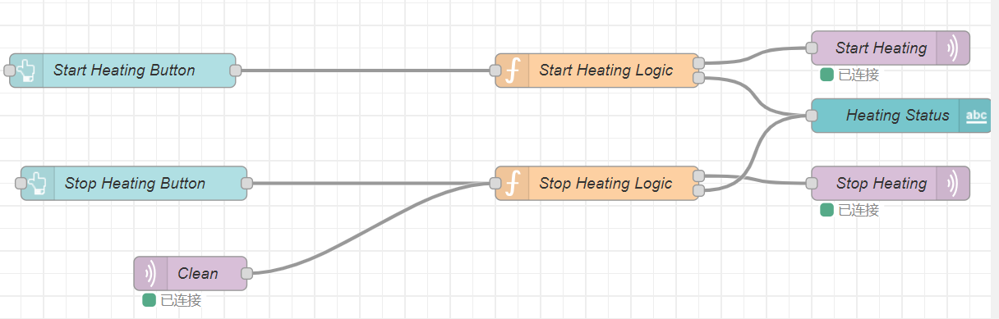

# a14g-final-submission

    * Team Number: T16
    * Team Name: Slap Queen
    * Team Members: Tianle Chen & Sitong Li
    * Github Repository URL: https://github.com/ese5160/a14g-final-submission-s25-t16-slap-queen
    * Description of test hardware: 1. SAMD21 + WINC1500 based PCBA 2.VEML7700 light sensor; MAX31855 temperature sensor 3. WS2812B RGB LED element; 5V 1A heating pad;ESP32-S3

## 1. Video Presentation

Youtube Link:

https://youtu.be/pzpXFrXEU1Y

## 2. Project Summary

### Device Description:

* This device is a system for nucleic acid amplification and end-point fluorescence detection. It allows users to control and monitor temperature, fluorescence intensity, and test results in real time through a Wi-Fi–based web interface.
* We were inspired by the need for low-cost, portable molecular diagnostic tools suitable for point-of-care testing. Traditional fluorescence-based detection systems are often bulky and expensive, so we aimed to develop a compact, battery-powered solution that enables accessible and automated nucleic acid testing.
* The device connects to a local Wi-Fi network and communicates with a Node-RED–based web dashboard via MQTT. This enables remote control of heating, LED excitation, and data acquisition, as well as real-time visualization of temperature, fluorescence intensity, and diagnostic results.

### Device Functionality:

* Our Internet-connected device is built around a SAMD21 microcontroller and a WINC1500 Wi-Fi module, enabling MQTT-based communication with a Node-RED dashboard. Upon connecting to a Wi-Fi network, the device can receive control commands and upload data including temperature, fluorescence intensity, and diagnostic results. The Node-RED interface also supports firmware updates and system monitoring.
* The device includes several key components:

  * A **heating pad** controlled via PWM and monitored using a **MAX31855 SPI-based thermocouple sensor** for temperature feedback.
  * A  **WS2812B RGB LED** , controlled by an  **ESP32-S3 via I2C** , provides blue light excitation for fluorescent dye.
  * A **VEML7700 I2C light sensor** detects end-point fluorescence intensity in the PCR tube.
  * Power is supplied by a  **4.2V LiPo battery** , stepped up to 5V and down to 3.3V via boost and buck converters.
  * All components are housed in a custom mechanical structure that ensures proper alignment between the LED, sensor, and PCR tube.
* System-level block diagram:

  

### Challenges:

**Problem 1:**

The I2C bus on the PCBA was non-functional; the light sensor soldered onto the board could not be initialized.

**Solution:**
A logic analyzer showed that the SCL line was stuck high while SDA functioned normally, indicating a likely manufacturing defect. We desoldered the sensor and rerouted SDA and SCL to a breadboard, where communication worked. All I2C devices were moved off-board.

**Problem 2:**
The RGB LED could not be controlled via the PCBA; the GPIO output pin did not respond.

**Solution:**
After confirming that the control code worked on the SAMW25 dev board, we suspected a broken trace on the PCBA. As the pin lacked a test point, we used an ESP32-S3 to control the LED via PWM and sent I2C commands from the PCBA to the ESP32 for indirect control.

**Problem 3:**
The SPI-based temperature sensor only returned valid data during the first read after reset, and failed afterward.

**Solution:**
We identified a conflict between the SPI clock and FreeRTOS scheduling. Instead of delaying, we reinitialized and disabled the SPI peripheral for every temperature read, making each access act as a fresh initialization.

**Problem 4:**
The USB-to-Serial chip was incorrectly flipped in the PCB layout, making it impossible to solder.

**Solution:**
We used nearby test points for TxD and RxD to connect an external USB-to-Serial adapter and restored communication successfully.

**Problem 5:**
The J-Link debugger could not detect the PCBA because the debugger port was miswired—pin 3 was incorrectly connected to 5V instead of GND.

**Solution:**
We checked the schematic and compared it with the reference design, then used a drill to cut the 5V via, left pin 3 floating, and manually rewired it to GND using solder.

**Problem 6:**
I2C devices could be initialized under FreeRTOS, but failed to return data during normal execution.

**Solution:**
Tracealyzer revealed that the Wi-Fi task consumed most CPU time. After increasing the priority of the I2C task, communication worked reliably.

### Prototype Learnings:

* **What lessons did you learn by building and testing this prototype?**

  We learned the critical importance of validating hardware interfaces—especially I2C and SPI—early in the prototyping process, ideally with external dev boards and logic analyzers before committing to custom PCB designs. We also gained experience in designing modular firmware using FreeRTOS and understanding how task priorities and peripheral initialization timing affect system behavior. Moreover, we realized the value of including test points and debugging access for every critical signal.
* **What would you do differently if you had to build this device again?**

  If we were to build the device again, we would revise the PCB layout to ensure all important I/O pins have test points, avoid flipping parts during layout without clear markings, and double-check all power and signal routing. We would also consider moving RGB LED control off the main MCU from the beginning to simplify timing constraints. Finally, we would design the system with more flexible debugging and firmware update paths, such as integrated USB-to-serial and software-controlled SPI/I2C reinitialization.

### Next Steps & Takeaways:

* **What steps are needed to finish or improve this project?**
  To improve the project, we plan to redesign the PCB to address hardware limitations such as improper I2C routing, missing test points, and misoriented components. We will not only add test points for I2C and SPI lines but also include external port connectors to facilitate easier debugging. From a firmware perspective, instead of only displaying the end-point fluorescence result, we will implement real-time fluorescence intensity curve plotting to provide users with more informative and traceable data. We also plan to replace the 4.2V LiPo battery with a 12V power adapter, since the current battery cannot reliably support heating functions for extended use—a fresh battery only lasts for about 1.5 hours over 5–6 uses. Furthermore, we aim to improve system reliability by refining power management and integrating a more robust firmware update mechanism.
* **What did you learn in ESE5160 through the lectures, assignments, and this course-long prototyping project?**
  One of the most valuable lessons from ESE5160 was learning to design and implement a bootloader. Like a gatekeeper, the bootloader allows for crucial pre-checks before launching the main application, which helps avoid hard-to-diagnose initialization issues and enables wireless firmware updates with greater flexibility and safety. Beyond the technical skills, the most impactful takeaway was developing a problem-solving and debugging mindset. Through observing the TAs, I learned that systematic debugging is a logical process driven by experience—knowing what to check first and why. This course gave us not just the tools, but the thinking framework to face real-world engineering challenges with confidence.

### Project Links:

Node Red backend:

http://52.151.18.200:1880/#flow/66f671320a5098f3

Node Red UI:

http://52.151.18.200:1880/ui/#!/2?socketid=uGIgYGEi1WTffyEBAABM

Altium Link:

https://upenn-eselabs.365.altium.com/designs/9CF3F784-0CCA-4230-B525-11A20F8A1D04

## 3. Hardware & Software Requirements

### Hardware Requirements:

* **HRS 01 – Power Supply**
  * ***Description:*** The device shall use a 12V DC power adapter as the primary power source. Appropriate voltage regulators (e.g., DC-DC buck converters) must supply 5V or 3.3V to the ESP32 XIAO, camera, LEDs, and ancillary components.
  * ***Status:*** We eventually switched to using a 4.2V LiPo battery and adopted a 5V boost converter and a 3.3V buck converter to power the entire development board. In A11G, we have already validated this power supply architecture through the Power System Evaluation section.
* **HRS 02 – Microcontrollers**
  * ***Description:*** The device shall use SAMW25 as the main MCU for system coordination and Wi-Fi connection. In addition, the device shall use the ESP32 XIAO as an image signal process device for image capture and processing.
  * ***Status:*** Our SAMD21 and WINC1500-based PCBA functioned as expected. Instead of using the ESP32-XIAO, I opted for the ESP32-S3 as the slave device to communicate with the PCBA via I2C, and used the ESP32 to control the RGB LED.
* **HRS 03 – Camera Module**
  * ***Description:*** An OV5640 camera module shall be integrated for capturing high-resolution fluorescence images.
  * ***Status:*** Ultimately, we did not use the ESP32-based camera solution. Instead, we opted for a combination of optical filters and the VEML7700 light sensor to detect the fluorescence intensity of the PCR tube. This I2C device simplified our initial camera-based approach while still providing sufficient performance.
* **HRS 04 – LED PCB**
  * ***Description:*** An SMD2835 blue LED array shall be mounted on a separate PCB to provide the ~470 nm excitation light for green fluorescent dyes.
  * ***Status:*** We used a single WS2812B RGB LED, with color control handled by the ESP32. During operation, the LED emits blue light to excite the fluorescent dye.
* **HRS 05 – Incubator**
  * ***Description:*** The system shall include a heater board with a temperature sensor for precise (±1°C) temperature control, typically 65°C for nucleic acid amplification.
  * ***Status:*** We successfully implemented the heating pad functionality along with its corresponding temperature control. We tested their functionality by double-checked with an IR thermometer. In this project, the temperature was ultimately set to 40°C to reduce power consumption, considering the limited capacity of the LiPo battery. However, in actual molecular detection applications, a target temperature of 65°C is still required.
* **HRS 06 – LCD Display**
  * ***Description:*** A small LCD screen (e.g., 2–4 inches) shall be integrated to show test instructions and results.
  * ***Status:*** We ultimately did not use the OLED display, as our PCBA's I2C bus encountered a manufacturing issue, which limited us to connecting I2C peripherals externally via a breadboard. Additionally, since we used an extra ESP32-S3 as an I2C slave to control the RGB LED, we decided to abandon the OLED display solution.
* **HRS 07 – I2C Communication**
  * ***Description:*** The ESP32 XIAO shall communicate final image analysis results back to the main controller via I2C. The temperature sensor shall also interface via I2C.
  * ***Status:*** The I2C bus on the PCBA encountered a manufacturing issue, so all I2C peripherals—including the VEML7700 light sensor and the ESP32-S3—were connected externally via a breadboard. Meanwhile, the temperature sensor was replaced with the MAX31855, which operates on the SPI bus. Based on tests using a logic analyzer, both the I2C and SPI buses functioned perfectly.
* **HRS 08 – Form Factor & Assembly**
  * ***Description:*** The camera module, LED PCB, and heater should fit together so that the sample area is appropriately illuminated and observed. The enclosure shall be designed for easy user access to insert/remove test samples.
  * ***Status:*** Based on our finalized peripheral device setup, all hardware components were successfully integrated and functioned as intended. A specialized mechanical design allowed the LED, light sensor, and PCR tube to be properly aligned and assembled to work effectively together.

### Software Requirements:

* **SRS 01 – Camera Capture**
  * ***Description:*** The software on the ESP32 XIAO shall capture images from the OV5640 sensor at a minimum of 1 frame per minute.
  * ***Status:*** We ultimately abandoned the camera-based solution and switched to a light sensor approach. At the end of the detection process, the MCU can, under the control of Node-RED, read the current light intensity and transmit the data back to the MCU via I2C.
* **SRS 02 – Image Processing**
  * ***Description:*** The ESP32 XIAO shall analyze the captured images to estimate fluorescence intensity.
  * ***Status:*** The final solution did not include any image processing components, as we switched to using a light sensor instead.
* **SRS 03 – Data Transfer to Main Board**
  * ***Description:*** Processed results (e.g., integer intensity values, pass/fail flags) shall be sent to the main controller via I2C within 5 seconds (±2s) after analysis.
  * ***Status:*** Our MCU includes both I2C and SPI buses. The I2C bus is used to transmit commands from the MCU to control the RGB LED and to read light intensity, as well as to receive light intensity data from the light sensor. The SPI bus is used to send commands from the MCU to read the current temperature and to receive the corresponding temperature data. Before integrating the peripherals, we tested both buses using a logic analyzer, and all functions worked as expected.
* **SRS 04 – Temperature Monitoring & Control**
  * ***Description:*** The software shall poll the incubator's temperature sensor every 5 seconds (±1s) and maintain the heating element at the setpoint (e.g., 65°C ±1°C).
  * ***Status:*** As mentioned in SRS03, we achieved real-time temperature feedback control of the heating pad using a SPI-based temperature sensor. With a proportional (P) control strategy, we were able to maintain the operating temperature of the heating pad within a ±1°C error range.
* **SRS 05 – LED Activation**
  * ***Description:*** The software shall activate the SMD2835 blue LED(s) for a specified duration before image capture, ensuring stable fluorescence excitation.
  * ***Status:*** In the final implementation, we used the I2C bus to control the ESP32-S3, which in turn managed the RGB LED element. The color control of the RGB LED was achieved through PWM on the ESP32, and we used the Arduino framework to implement the LED control functionality.
* **SRS 06 – Display & UI**
  * ***Description:*** The main controller shall display test status and results on a small LCD screen and offer a smartphone web UI to view the same results.
  * ***Status:*** In the final implementation, we designed a Node-RED-based webpage that can display the current temperature, detected fluorescence intensity, test result (POSITIVE/NEGATIVE), and the current software version in real time. The webpage also provides control functions for the device. Due to hardware issues, we ultimately did not use the OLED display.
* **SRS 07 – Connectivity**
  * ***Description:*** The device shall transmit final test results over Wi-Fi to a secure server or phone application.
  * ***Status:*** We set up an MQTT virtual machine and enabled the MCU to be controlled via the Node-RED webpage once connected to Wi-Fi. This control includes firmware updates as well as the operation of actuators and sensors.
* **SRS 08 – Low Power / Idle Mode**
  * ***Description:*** The system shall enter a low-power state when inactive for more than 2 minutes and resume normal operation upon user interaction or next scheduled test cycle.
  * ***Status:*** By adjusting the priority of FreeRTOS tasks and enabling FreeRTOS idle mode, we successfully achieved low-power operation when the device is powered on but not actively running tasks. Using Tracealyzer, we were able to analyze the MCU's task execution and system behavior.

## 4. Project Photos & Screenshots

The final project:

Standalone PCBA:

Thermal camera image:

Altium Board Design (2D):

Altium Board Design (3D):

Node-Red Dashboard:

Node-Red backend:

Block Diagram:

## Codebase

- A link to your final embedded C firmware codebases

  https://github.com/ese5160/final-project-t16-slap-queen
- A link to your Node-RED dashboard code

  http://52.151.18.200:1880/#flow/66f671320a5098f3
- Links to any other software required for the functionality of your device

  ESP32-S3 Arduino firmware link:

  https://github.com/ese5160/final-project-t16-slap-queen/tree/main/esp32_i2c_slave_neopixel
